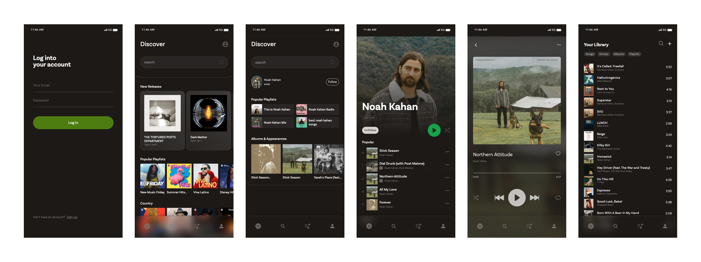
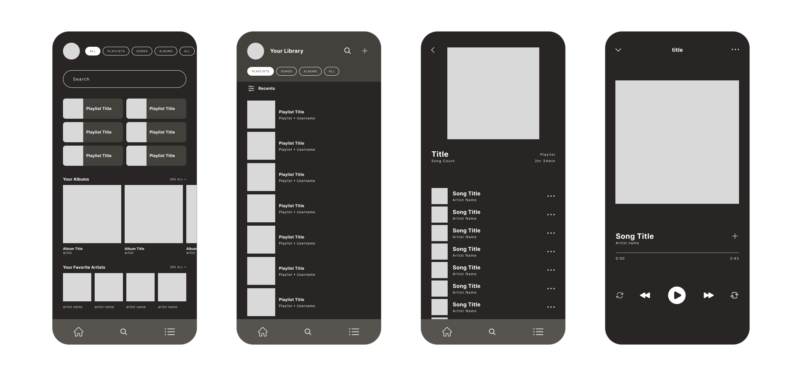
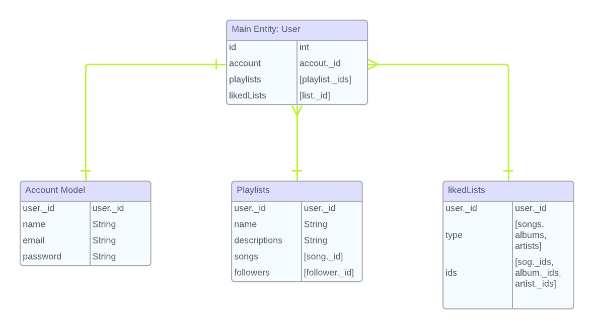
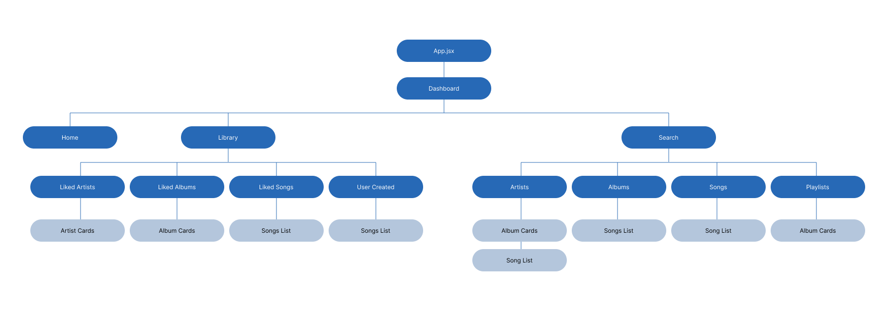

# Spotify Clone
I use Spotify all day, every day and have been for decades it feels. I wanted to recreate Spotify, but with my design vision and customized to how I would want to curate playlist and collaboration lists. Spotify has a lovely UI system already, so this is my Spotify Reimagined. 

### Technology Used 
--- 
MongoDB
 
Express
 
React
 
Node.js
 
JavaScript
 
Tailwind
 
 _(tailwind-animate, tailwind-aspect-ratio)_
 

### Finished Project
---
View the deployed Vercel app [here](https://spotify-clone-three-omega.vercel.app/)
 
View front-end repository [here](https://github.com/lillianlayne/spotify-clone)

### Wireframes
---

### ERD Model
---

### Component Hierarchy
---

### Getting Started 
---

### Other Sources
---
__Figma__: Creating high-fidelity wireframing and component organization 
 
__SpotifyAPI__: Utilizing Spotify's API to retrieve data on the music industry
 
__SpotifyAPI Docs__: All [documentation](https://developer.spotify.com/documentation/web-api) on the Spotify API database
 
__Vercel__: Front-end deployment
 
__Heroku__: Back-end deployment
